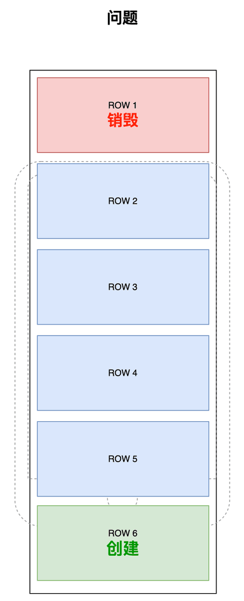
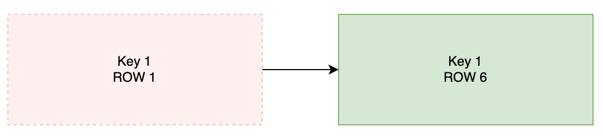

HippyRecycleListView
----

HippyRecycleListView 是一个纯前端实现的 Hippy ListView 替代品，提供了更灵活的布局能力，以及良好的性能表现。

它是为满足较特殊的设计需求而开发的组件，目前没有和 Hippy ListView 做过严谨的性能对比，各种能力不全面，也无意对标原生实现。

**在两者都能满足需求的情况下，应尽量选择 Hippy Listview**。

## 0. 快速开始

```
npm install hippy-recycle-listview
```

范例参考 `demo`

## 1. 解决什么问题

Android 上的 Hippy ListView，如果某一行的内容高度超出行高本身会被裁剪，就像下面展示的这样：


目前为止我还没找到什么办法禁用这种裁剪行为，所以当出现这种设计，原生的 ListView 就无法满足需求了。本组件就是为了实现上图这种列表设计而开发。

## 2. 实现思路

要实现这个设计，最简单的方案是换用 ScrollView + 绝对定位，然后不指定固定的行高。

因为每一行没有固定行高，所以内容不会被裁剪，而是行容器根据内容自动扩大。而行的 y 坐标是绝对定位指定的，所以行容器变高不会影响行高。就实现了不会裁剪内容的 ListView。

接下来只需要将所有的 row 都绘制到 ScrollView 中对应的位置即可：


显然这种方式在数据量大的时候存在严重的性能问题，所以可以这样进行一个初步的优化：


从渲染所有 row，改为仅渲染可视范围内的 row。如上图中 ROW 1/6 不可见，所以可以不用渲染。

但这样优化还有问题，那就是滑动时不可避免会频繁发生 ROW 的创建和销毁。比如当我们向上滑动导致 ROW 1 离开屏幕，ROW 6 进入屏幕时：



如果 row 较为复杂，或用户滑动速度很快时，这个问题导致的卡顿就会很明显。我们可以通过行复用来解决这个问题：


当 ROW 1 离开屏幕时，它不会被销毁而是被保留。后续当 ROW 6 要进入屏幕时，原本的 ROW 1 被重新复用。数据被更新为 ROW 6，并挪动到 ROW 6 应在的位置。

其中的关键在与，我们给每个视图都分配了另外一个固定的 key。新 key 和数据无关，只要改变传入的 props，`key 1` 的内容就可以从 `ROW 1` 变成` ROW 6`：



在上文的简单例子中，react 从头到尾只渲染了 5 个不同的组件（Key 1~5），只是它们的 props 在不断变化（ROW 1~N）。

## 3. 优化效果

对比“仅渲染可见范围”的初步优化，我们的行复用方案有明显优势：


从屏幕下方的图表中可以看出，右侧行复用方案的渲染耗时更稳定，卡顿更少。

## 4. 现存问题

缺失许多 ListView 的常用功能，比如不支持不同的行高、横向滑动、下拉刷新、滑动到底部回调等等。

行（key）复用的逻辑也缺少失效机制，池中的行数只会新增，很久没有被复用/相同类型过多的行不会被删除。

这里是战术性功能不全🐶，不是业务需要，不建议同事们填坑。

因为本组件解决的唯一痛点就是 Hippy ListView 行内容出界的裁剪问题，是为了特定业务需求做的基本实现。

而这一个痛点已经跟 Hippy 同事反馈过了，过阵子如果建议接受了这个组件也就没有存在的必要了。所以不需要浪费更多精力在功能补全，更多是分享优化方案探讨思路。